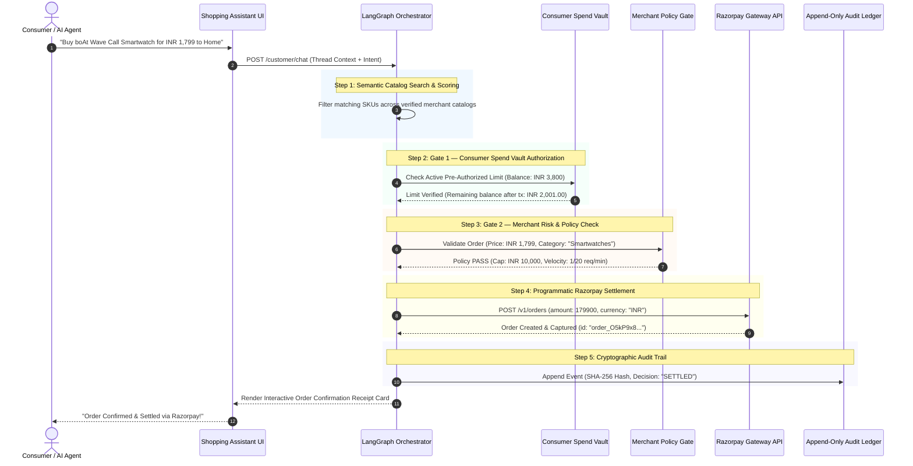

<div align="center">


# Agentpay
### Autonomous Payment & Settlement Infrastructure for AI Commerce Agents

[](https://buildathon-nu-eight.vercel.app)
[-dc2626.svg?style=flat-square)](LICENSE)
[](https://nextjs.org/)
[](https://fastapi.tiangolo.com/)
[](https://langchain-ai.github.io/langgraph/)
[](backend/tests)

<br />

**"LLM proposes, engine disposes."**  
*The open-source, dual-gated commerce infrastructure enabling autonomous AI buyer agents to discover, verify, and settle payments safely through Razorpay without human 2FA friction.*

[Live Platform](https://buildathon-nu-eight.vercel.app) • [Consumer Assistant](https://buildathon-nu-eight.vercel.app/customer/chat) • [Merchant Portal](https://buildathon-nu-eight.vercel.app/dashboard) • [Admin Console](https://buildathon-nu-eight.vercel.app/admin) • [Architecture Guide](#system-architecture--execution-flow)

</div>

---

> [!IMPORTANT]
> **Official Buildathon Submission Notice**  
> **Author & Creator**: Prem Patel ([@prempatel-ai](https://github.com/prempatel-ai))  
> **Buildathon Track**: Track 01: AI Growth & Agentic Commerce (Razorpay AI Buildathon 2026)  
> **Copyright & Priority**: Copyright (c) 2026 Prem Patel. All Rights Reserved. Initial Git Commit Timestamp Verified.  
> *Any unauthorized copying, cloning, or submission of this codebase by third parties will be reported immediately to Razorpay AI Buildathon organizers and Devfolio for automated plagiarism disqualification.*

---

## Table of Contents

- [Executive Summary](#executive-summary)
- [Platform Interface Showcase](#platform-interface-showcase)
- [Problem Definition](#problem-definition)
- [Architectural Pillars](#architectural-pillars)
- [System Architecture & Execution Flow](#system-architecture--execution-flow)
- [LangGraph Multi-Agent Orchestrator](#langgraph-multi-agent-orchestrator)
- [Core Features & Capabilities](#core-features--capabilities)
  - [1. Consumer Spend Vault & Pre-Authorizations](#1-consumer-spend-vault--pre-authorizations)
  - [2. Deterministic Merchant Risk Engine](#2-deterministic-merchant-risk-engine)
  - [3. Intelligent Excel & CSV Product Ingestion](#3-intelligent-excel--csv-product-ingestion)
  - [4. Machine-Readable Schema.org Agent Feeds](#4-machine-readable-schemaorg-agent-feeds)
  - [5. Razorpay Settlement & HMAC Webhooks](#5-razorpay-settlement--hmac-webhooks)
  - [6. Immutable Cryptographic Audit Ledger](#6-immutable-cryptographic-audit-ledger)
- [Comparison: Legacy Gateways vs. Agentpay](#comparison-legacy-gateways-vs-agentpay)
- [REST API Reference](#rest-api-reference)
- [Directory Structure](#directory-structure)
- [Quickstart Guide](#quickstart-guide)
- [Testing & Verification](#testing--verification)
- [Demo Accounts](#demo-accounts)
- [License & Acknowledgments](#license--acknowledgments)

---

## Platform Interface Showcase

### 1. Consumer Autonomous Commerce & Spend Vault
| Autonomous AI Shopping Assistant & Settlement | Consumer Spend Vault & Tokenized Card Caps |
|:---:|:---:|
|  |  |
| *Real-time natural language discovery with programmatic Razorpay settlement receipt.* | *Tokenized instrument vault with configurable per-transaction spending limit.* |

### 2. Merchant Operations & Analytics Suite
| Live Catalog & AI Discovery Inventory | Executive Performance Analytics & Volume Timeline |
|:---:|:---:|
|  |  |
| *Manage SKUs, stock levels, and verify machine-readable JSON-LD schema feeds.* | *Real-time telemetry on gross settled protocol volume and gating decisions.* |

| Immutable Cryptographic Audit Trail |
|:---:|
|  |
| *Chronological append-only ledger with automated PII masking and decision reasoning.* |

### 3. Platform Admin & Governance Console
| Platform Overview & Protocol Metrics | Multi-Merchant Moderation & KYC Directory |
|:---:|:---:|
|  |  |
| *Global settled volume ledger and dual-gate bounded execution status.* | *Multi-tenant store verification, SKU monitoring, and instant moderation.* |

---

## Executive Summary

As LLM agents evolve from conversational assistants into **autonomous economic buyers**, legacy payment gateways create fundamental blockers:

1. **Interactive 2FA Barriers**: Traditional gateways require interactive human confirmation (SMS OTPs, 3D-Secure frames, biometric prompts) that programmatic agents cannot complete.
2. **Financial Execution Risk**: Unrestricted API access exposes merchants and consumers to prompt injections, hallucinated quantities, runaway spend loops, and inventory abuse.
3. **Unstructured Data Ingestion**: Agents are forced to scrape brittle HTML storefronts, leading to pricing errors, stale stock levels, and broken checkout journeys.

**Agentpay** introduces a **Dual-Gated Protocol** that strictly decouples AI intent generation from financial execution. The LLM agent discovers products, clarifies intent, and proposes structured transactions. The deterministic protocol verifies the consumer's authorized limit, enforces merchant risk policies, writes an immutable audit record, and settles the order directly via Razorpay.

---

## Problem Definition

```text
       TRADITIONAL E-COMMERCE CHECKOUT                       AGENTPAY DUAL-GATED PROTOCOL
  ┌────────────────────────────────────────┐            ┌────────────────────────────────────────┐
  │ Human enters card details in form      │            │ AI Buyer proposes structured purchase  │
  │ Gateways trigger 3D-Secure SMS OTP     │            │ { sku, price, qty, destination }      │
  │ Human types 6-digit OTP on phone       │            └───────────────────┬────────────────────┘
  └───────────────────┬────────────────────┘                                │
                      │                                                     ▼
                      ▼                                 ┌────────────────────────────────────────┐
        [!] FAILS FOR AUTONOMOUS AGENTS                 │ GATE 1: Consumer Spend Vault           │
     (Programmatic agents cannot read SMS               │ • Remaining authorized balance check   │
      OTPs or interact with 3DS iframes)                │ • Merchant whitelist & expiry window   │
                                                        └───────────────────┬────────────────────┘
                                                                            │
                                                                            ▼
                                                        ┌────────────────────────────────────────┐
                                                        │ GATE 2: Merchant Policy Engine         │
                                                        │ • Per-transaction price cap check      │
                                                        │ • Category restriction verification    │
                                                        │ • Redis sliding-window velocity limit  │
                                                        └───────────────────┬────────────────────┘
                                                                            │
                                                                            ▼
                                                        ┌────────────────────────────────────────┐
                                                        │ GATE 3: Razorpay Settlement & Audit    │
                                                        │ • Programmatic Order Creation          │
                                                        │ • HMAC-SHA256 Signed Webhook Dispatched│
                                                        │ • Immutable SHA-256 Audit Trail Logged │
                                                        └────────────────────────────────────────┘
```

---

## Architectural Pillars

```text
┌───────────────────────────────────────────────────────────────────────────────────────────────────┐
│                                       AGENTPAY ARCHITECTURE                                       │
├───────────────────────────────┬───────────────────────────────────┬───────────────────────────────┤
│    1. CONSUMER SPEND VAULT    │     2. MERCHANT POLICY ENGINE     │   3. RAZORPAY SETTLEMENT      │
│  • Tokenized UPI/Card limits  │   • Deterministic order cap rules │   • Programmatic Order APIs   │
│  • Per-session spend ceilings │   • Allowed category filters      │   • HMAC-SHA256 Webhook logs  │
│  • 1-Click delivery switching │   • Redis velocity rate limits    │   • SHA-256 Immutable Ledger  │
└───────────────────────────────┴───────────────────────────────────┴───────────────────────────────┘
```

---

## System Architecture & Execution Flow



---

## LangGraph Multi-Agent Orchestrator

The conversational reasoning layer is powered by a stateful **LangGraph StateGraph** consisting of 4 deterministic nodes:

```text
                 ┌────────────────────────┐
                 │   User Prompt Input    │
                 └───────────┬────────────┘
                             │
                             ▼
                 ┌────────────────────────┐
                 │     1. Router Node     │  --> Classifies intent (Search | Policy | Buy | Conversational)
                 └───────────┬────────────┘
                             │
            ┌────────────────┴────────────────┐
            ▼                                 ▼
┌────────────────────────┐       ┌────────────────────────┐
│  2. Catalog Discovery  │       │  3. Policy & Spend Gate│
│ (Relevance & Synonyms) │       │ (Vault + Merchant Cap) │
└───────────┬────────────┘       └────────────┬───────────┘
            │                                 │
            └────────────────┬────────────────┘
                             │
                             ▼
                 ┌────────────────────────┐
                 │  4. Razorpay Executor  │  --> Programmatic Razorpay Order Creation
                 └───────────┬────────────┘
                             │
                             ▼
                 ┌────────────────────────┐
                 │    Audit Trail Node    │  --> Cryptographic event recorded to database
                 └────────────────────────┘
```

---

## Core Features & Capabilities

### 1. Consumer Spend Vault & Pre-Authorizations
- **Bounded Autonomous Spending**: Shoppers establish virtual transaction limits with a single click.
- **Spend Limit Indicator**: Embedded status pill directly inside the shopping assistant interface.
- **Delivery Destination Selector**: Switch or provision shipping destinations inline.
- **Persistent Discussion Threads**: Multi-thread conversation history stored securely with instant switching and deletion.

### 2. Deterministic Merchant Risk Engine
- **Per-Transaction Price Ceilings**: Enforce maximum order amounts per autonomous request.
- **Category Whitelisting**: Restrict AI buyers to specific merchant-approved categories.
- **Sliding-Window Velocity Limiter**: Redis-backed velocity caps to prevent automated spam and runaway loops.
- **Zero-Flicker SWR Caching**: Instant hydration using Stale-While-Revalidate caching for store metadata and inventory.

### 3. Intelligent Excel & CSV Product Ingestion
- **Multi-Format Ingestion**: Native parsing for Excel spreadsheets (`.xlsx`, `.xls`), CSV (`.csv`), and JSON.
- **Fuzzy Column Header Normalization**: Automatically identifies product attributes regardless of naming conventions.
- **Live Extracted Products Preview**: Interactive preview table with SKU counts before committing to the live catalog.
- **Sample Template Export**: 1-click template export for merchant onboarding.

### 4. Machine-Readable Schema.org Agent Feeds
- **Zero-Scraping AI Discovery**: Generates standard `Schema.org/Product` JSON-LD endpoints (`GET /catalog/agent-schema?merchant_id=...`).
- **OpenAPI Tool Definitions**: LLM agents can inspect stock levels, pricing, specifications, and SKU availability directly.

### 5. Razorpay Settlement & HMAC Webhooks
- **Programmatic Settlement**: Captures orders programmatically with custom receipt IDs and structured metadata.
- **HMAC SHA-256 Webhook Verification**: Cryptographically signed webhooks dispatched to merchant callback endpoints.
- **Exponential Backoff Retry**: Resilient 3-attempt retry pipeline for failing webhook destinations.

### 6. Immutable Cryptographic Audit Ledger
- **Multi-Actor Logging**: Traces all activities across `Customer`, `Agent`, `Merchant`, and `System` actors.
- **Tamper-Evident SHA-256 Hashes**: Every policy evaluation, price check, and payment record produces an integrity hash.
- **Audit REST API**: Queryable by merchant ID, date ranges, and actor types (`GET /audit`).

---

## Comparison: Legacy Gateways vs. Agentpay

| Feature / Capability | Legacy Gateways (Stripe, Razorpay Standard) | Scraping Bots (Browser Use) | Agentpay Autonomous Protocol |
| :--- | :---: | :---: | :---: |
| **Autonomous Execution** | ✕ Fails (Demands 2FA/OTP) | △ Brittle (DOM shifts) | **✓ 100% Programmatic Execution** |
| **Spend Limit Controls** | ✕ None (Full card exposed) | ✕ None | **✓ Virtual Spend Vaults & Caps** |
| **Merchant Risk Guardrails** | △ Post-transaction scoring | ✕ None | **✓ Deterministic Pre-Payment Gate** |
| **Catalog Discoverability** | ✕ Human HTML Only | △ High-latency Scraping | **✓ Instant JSON-LD Agent Feeds** |
| **Bulk Catalog Ingestion** | △ Manual Individual Forms | ✕ None | **✓ Excel & CSV File Parsing** |
| **Cryptographic Auditability** | △ Standard Dashboard Logs | ✕ None | **✓ Append-Only SHA-256 Audit Trail** |

---

## REST API Reference

### Authentication & Merchant Onboarding
| Method | Endpoint | Description |
| :--- | :--- | :--- |
| `POST` | `/auth/register` | Register new merchant store with hashed credentials |
| `POST` | `/auth/login` | Merchant login & JWT token issuance with auto-demo sync |
| `POST` | `/merchants/seed` | Instant demo merchant & catalog provisioner |
| `GET` | `/merchants/me` | Fetch authenticated merchant profile & policy limits |

### Catalog & Agent Feeds
| Method | Endpoint | Description |
| :--- | :--- | :--- |
| `GET` | `/catalog/items` | List all catalog products for a merchant |
| `POST` | `/catalog/items` | Create a new catalog SKU |
| `POST` | `/catalog/bulk-import` | Bulk import products parsed from Excel / CSV |
| `GET` | `/catalog/agent-schema` | Machine-readable Schema.org JSON-LD agent feed |

### Consumer Shopping & Agent Assistant
| Method | Endpoint | Description |
| :--- | :--- | :--- |
| `POST` | `/customer/chat` | Main LangGraph conversational agent interaction node |
| `GET` | `/customer/authorizations/me` | Fetch active customer spend vault & balance |
| `POST` | `/customer/authorizations` | Set or update customer pre-authorized spend limit |
| `GET` | `/customer/addresses` | List saved consumer delivery addresses |
| `POST` | `/customer/addresses` | Add a new delivery destination |

### Policy Governance & Audit Ledger
| Method | Endpoint | Description |
| :--- | :--- | :--- |
| `GET` | `/policies` | Fetch merchant risk & spending policies |
| `PUT` | `/policies/{id}` | Update merchant max order caps or category rules |
| `GET` | `/audit` | Query immutable multi-actor cryptographic audit trail |

---

## Directory Structure

```text
buildathon/
├── backend/
│   ├── app/
│   │   ├── agents/            # LangGraph multi-agent StateGraph & prompt nodes
│   │   ├── core/              # Config, DB connections, JWT security, Rate limiters
│   │   ├── models/            # SQLAlchemy models (Merchant, Catalog, Policy, Audit, etc.)
│   │   ├── routers/           # FastAPI REST endpoints (Auth, Catalog, Customer, Admin)
│   │   ├── schemas/           # Pydantic validation schemas
│   │   └── services/          # Business logic (Merchant, Audit, Catalog, Webhooks)
│   ├── tests/                 # Automated Pytest suite (30+ tests)
│   ├── main.py                # FastAPI ASGI application entrypoint
│   ├── seed.py                # Database seeder (25 merchants & 150+ SKUs)
│   └── requirements.txt       # Python dependencies
│
├── frontend/
│   ├── app/
│   │   ├── customer/
│   │   │   ├── chat/          # AI Shopping Assistant with persistent threads
│   │   │   ├── dashboard/     # Spend Vault & pre-authorized limit controls
│   │   │   ├── addresses/     # Delivery address management
│   │   │   └── login/         # Consumer portal authentication
│   │   ├── dashboard/         # Merchant Overview, metrics, and Excel importer
│   │   ├── onboarding/        # Store creator & 1-click demo launch
│   │   ├── settings/          # Policy & Governance risk management
│   │   ├── agents-list/       # AI Agent API key manager
│   │   ├── audit/             # Tamper-evident cryptographic audit logs
│   │   ├── webhooks/          # Webhook endpoint configuration & delivery logs
│   │   ├── usage/             # Analytics, velocity limits & order volume charts
│   │   ├── admin/             # Platform Admin Governance Console
│   │   └── login/             # Minimalist Merchant Portal Sign In
│   ├── components/            # Reusable UI components (Navigation, Logo, Modals)
│   └── lib/                   # API client, SWR initializers & auth guards
│
├── img/                       # Platform documentation and UI showcase assets
├── README.md                  # Project documentation
└── docker-compose.yml         # Containerized setup
```

---

## Quickstart Guide

### Prerequisites
- **Python**: `3.11+`
- **Node.js**: `18.0+`
- **PostgreSQL** & **Redis** (optional; SQLite fallback supported)

### 1. Clone the Repository
```bash
git clone https://github.com/prempatel-ai/buildathon.git
cd buildathon
```

### 2. Backend Setup
```bash
cd backend
python -m venv venv

# Windows:
.\venv\Scripts\activate
# Linux/macOS:
source venv/bin/activate

pip install -r requirements.txt

# Run initial database seeder
python seed.py

# Start FastAPI server
uvicorn main:app --reload --port 8000
```
*API documentation available at: `http://localhost:8000/docs`*

### 3. Frontend Setup
```bash
cd ../frontend
npm install
npm run dev
```
*Frontend application live at: `http://localhost:3000`*

---

## Testing & Verification

Agentpay is backed by an automated **30+ Pytest suite** covering unit logic, LangGraph agent routing, policy evaluations, and Razorpay signature checks:

```bash
cd backend
pytest -v
```

**Next.js Production Build Validation**:
```bash
cd frontend
npm run build
```
*(Verified: 0 compilation or TypeScript errors across all 20 routes)*

---

## Demo Accounts

| Role | Portal URL | Email | Password | Pre-Configured State |
| :--- | :--- | :--- | :--- | :--- |
| **Merchant Store** | [`/login`](https://buildathon-nu-eight.vercel.app/login) | `demo@agentpay.dev` | `Demo@1234` | Boat Lifestyle Store, 8 SKUs, Live Policies |
| **Consumer Buyer** | [`/customer/login`](https://buildathon-nu-eight.vercel.app/customer/login) | `rahul@example.com` | `Demo@1234` | INR 3,800 Spend Vault, Saved Home Address |
| **Platform Admin** | [`/admin/login`](https://buildathon-nu-eight.vercel.app/admin/login) | `admin` | `Admin@Agentpay2026` | Global Multi-Tenant Governance Console |

---

## License & Ownership

**Copyright (c) 2026 Prem Patel. All Rights Reserved.**

This project, source code, system architecture, multi-agent orchestrator design, database schemas, visual branding, and underlying concepts are **proprietary and confidential**. No person or entity may copy, modify, distribute, host, fork, reverse engineer, or commercialize any portion of this repository or project without explicit prior written consent from **Prem Patel**. See [LICENSE](LICENSE) for complete legal terms.

Built for the **Razorpay AI Buildathon 2026** (Track 01: AI Growth & Agentic Commerce).

<div align="center">
  <sub>Engineered by <a href="https://github.com/prempatel-ai">Prem Patel</a> and the Agentpay Team.</sub>
</div>
