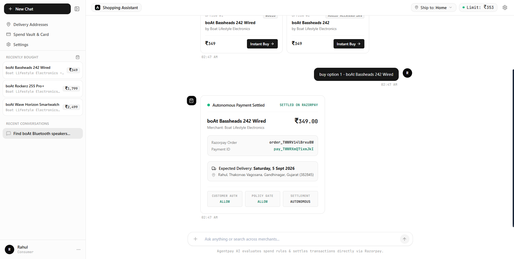
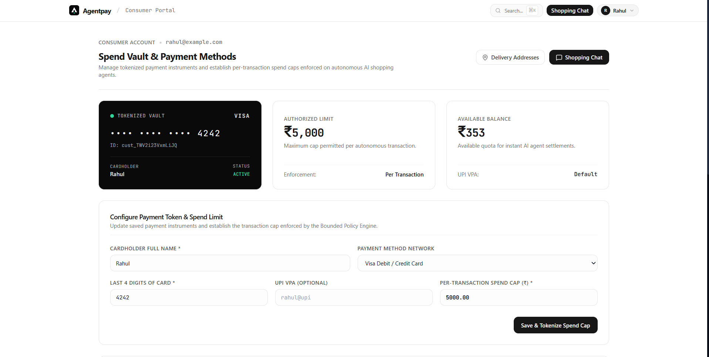
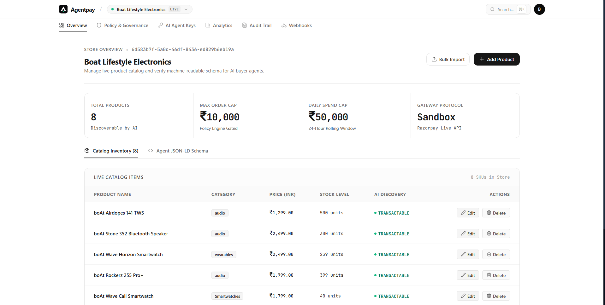
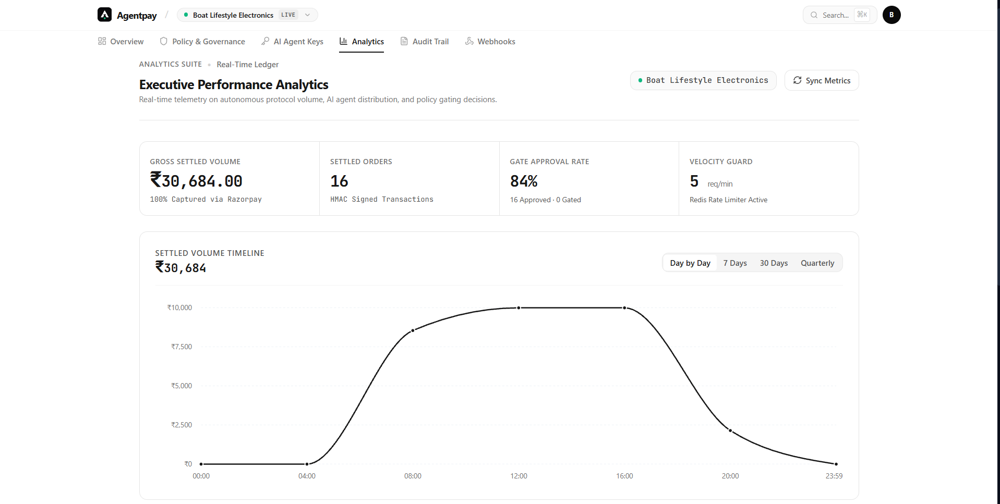
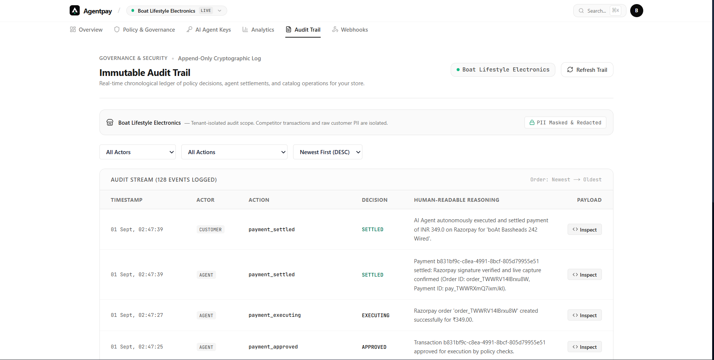
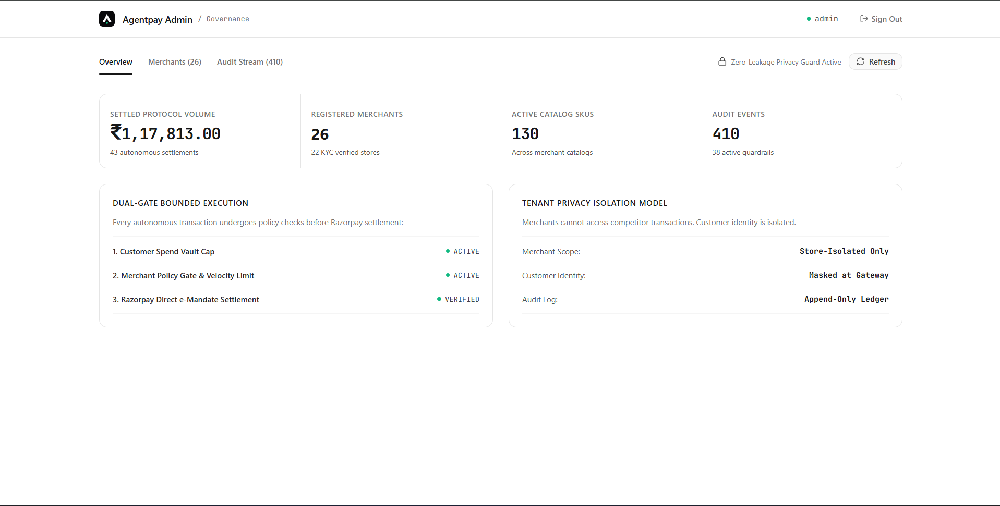
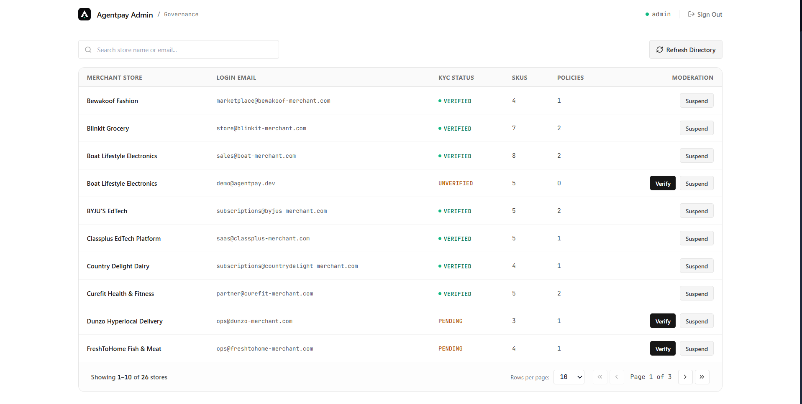
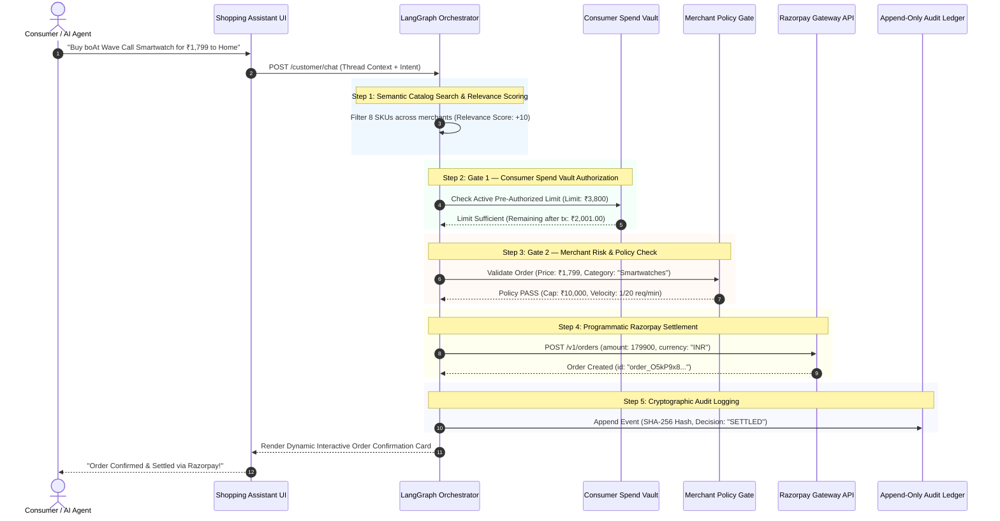

<div align="center">

# ⚡ Agentpay
### The Autonomous Payment & Settlement Protocol for AI Shopping Agents

[](https://buildathon-nu-eight.vercel.app)
[](LICENSE)
[](https://nextjs.org/)
[](https://fastapi.tiangolo.com/)
[](https://langchain-ai.github.io/langgraph/)
[](backend/tests)

<br />

**"LLM proposes, engine disposes."**  
*The open-source, dual-gated commerce infrastructure enabling autonomous AI buyer agents to discover, verify, and settle payments safely through Razorpay without human 2FA friction.*

[🚀 Live Demo](https://buildathon-nu-eight.vercel.app) • [🛍️ AI Shopping Assistant](https://buildathon-nu-eight.vercel.app/customer/chat) • [🏪 Merchant Console](https://buildathon-nu-eight.vercel.app/dashboard) • [📖 Documentation](#-system-architecture)

</div>

---

## 📑 Table of Contents

- [Executive Summary & The Paradigm Shift](#-executive-summary--the-paradigm-shift)
- [Platform Interface Showcase](#-platform-interface-showcase)
- [The Problem We Solve](#-the-problem-we-solve)
- [Core Architectural Pillars](#-core-architectural-pillars)
- [System Architecture & Flow](#-system-architecture--flow)
- [Interactive LangGraph Multi-Agent Engine](#-interactive-langgraph-multi-agent-engine)
- [Complete Feature Breakdown](#-complete-feature-breakdown)
  - [1. Consumer Spend Vault & Virtual Limits](#1-consumer-spend-vault--virtual-limits)
  - [2. Deterministic Merchant Risk Engine](#2-deterministic-merchant-risk-engine)
  - [3. Excel & CSV Intelligent Product Importer](#3-excel--csv-intelligent-product-importer)
  - [4. Machine-Readable Schema.org Feeds](#4-machine-readable-schemaorg-feeds)
  - [5. Razorpay Settlement & Webhook Dispatcher](#5-razorpay-settlement--webhook-dispatcher)
  - [6. Immutable Cryptographic Audit Ledger](#6-immutable-cryptographic-audit-ledger)
- [Comparison Matrix: Legacy vs Agentpay](#-comparison-matrix-legacy-vs-agentpay)
- [API Endpoints Reference](#-api-endpoints-reference)
- [Project Directory Structure](#-project-directory-structure)
- [Quickstart & Local Setup Guide](#-quickstart--local-setup-guide)
- [Testing & Quality Assurance](#-testing--quality-assurance)
- [Environment Variables](#-environment-variables)
- [Demo Credentials](#-demo-credentials)
- [License & Acknowledgments](#-license--acknowledgments)

---

## 📸 Platform Interface Showcase

### 1. Consumer Autonomous Commerce & Spend Vault
| Autonomous AI Shopping Assistant & Settlement | Consumer Spend Vault & Tokenized Card Caps |
|:---:|:---:|
|  |  |
| *Real-time natural language discovery with programmatic Razorpay settlement receipt.* | *Tokenized instrument vault with configurable per-transaction spending limit.* |

### 2. Merchant Operations & Analytics Suite
| Live Catalog & AI Discovery Inventory | Executive Performance Analytics & Volume Timeline |
|:---:|:---:|
|  |  |
| *Manage SKUs, stock levels, and verify machine-readable JSON-LD schema feeds.* | *Real-time telemetry on gross settled protocol volume and gating decisions.* |

| Immutable Cryptographic Audit Trail |
|:---:|
|  |
| *Chronological append-only ledger with automated PII masking and decision reasoning.* |

### 3. Platform Admin & Governance Console
| Platform Overview & Protocol Metrics | Multi-Merchant Moderation & KYC Directory |
|:---:|:---:|
|  |  |
| *Global settled volume ledger and dual-gate bounded execution status.* | *Multi-tenant store verification, SKU monitoring, and instant moderation.* |

---

## 🌟 Executive Summary & The Paradigm Shift

As LLM agents (LangGraph, OpenAI Assistants, Claude Computer Use, AutoGPT) evolve from basic conversational chatbots into **autonomous economic actors**, traditional payment gateways break:

1. **Gateways demand interactive human 2FA** (SMS OTPs, biometric prompts, 3D-Secure iframes) which programmatic AI buyers cannot complete.
2. **Unrestricted API access creates existential financial risk** — prompt injections, hallucinated order quantities, runaway spend loops, and stock manipulation.
3. **Merchants have no machine-readable catalogs** — agents are forced to scrape brittle HTML pages, leading to price errors and checkout failures.

**Agentpay** provides the missing infrastructure layer: a **Dual-Gated Protocol** that separates AI intent generation from financial execution. The AI agent searches, plans, and proposes transactions; the deterministic protocol verifies consumer authorization, enforces merchant policy rules, records an immutable audit trail, and programmatically captures settlements via Razorpay.

---

## 🚫 The Problem We Solve

```text
       TRADITIONAL E-COMMERCE CHECKOUT                       AGENTPAY DUAL-GATED PROTOCOL
  ┌────────────────────────────────────────┐            ┌────────────────────────────────────────┐
  │ Human enters card details in form      │            │ AI Buyer proposes structured purchase  │
  │ Gateways trigger 3D-Secure SMS OTP     │            │ { sku, price, qty, destination }      │
  │ Human types 6-digit OTP on phone       │            └───────────────────┬────────────────────┘
  └───────────────────┬────────────────────┘                                │
                      │                                                     ▼
                      ▼                                 ┌────────────────────────────────────────┐
        ❌ FAILS FOR AUTONOMOUS AGENTS                  │ GATE 1: Consumer Spend Vault           │
     (AI agents cannot read SMS OTPs                    │ • Remaining authorized balance check   │
      or click interactive 3DS frames)                  │ • Merchant whitelist & expiry window   │
                                                        └───────────────────┬────────────────────┘
                                                                            │
                                                                            ▼
                                                        ┌────────────────────────────────────────┐
                                                        │ GATE 2: Merchant Policy Engine         │
                                                        │ • Per-transaction price cap check      │
                                                        │ • Category restriction verification    │
                                                        │ • Redis sliding-window velocity limit  │
                                                        └───────────────────┬────────────────────┘
                                                                            │
                                                                            ▼
                                                        ┌────────────────────────────────────────┐
                                                        │ GATE 3: Razorpay Settlement & Audit    │
                                                        │ • Programmatic Order Creation          │
                                                        │ • HMAC-SHA256 Signed Webhook Dispatched│
                                                        │ • Immutable SHA-256 Audit Trail Logged │
                                                        └────────────────────────────────────────┘
```

---

## 🏛️ Core Architectural Pillars

```text
┌───────────────────────────────────────────────────────────────────────────────────────────────────┐
│                                       AGENTPAY ARCHITECTURE                                       │
├───────────────────────────────┬───────────────────────────────────┬───────────────────────────────┤
│    1. CONSUMER SPEND VAULT    │     2. MERCHANT POLICY ENGINE     │   3. RAZORPAY SETTLEMENT      │
│  • Tokenized UPI/Card limits  │   • Deterministic order cap rules │   • Programmatic Order APIs   │
│  • Per-session spend ceilings │   • Allowed category filters      │   • HMAC-SHA256 Webhook logs  │
│  • 1-Click delivery switching │   • Redis velocity rate limits    │   • SHA-256 Immutable Ledger  │
└───────────────────────────────┴───────────────────────────────────┴───────────────────────────────┘
```

---

## 🔄 System Architecture & Flow



---

## 🤖 Interactive LangGraph Multi-Agent Engine

The backend agent is powered by a stateful **LangGraph StateGraph** consisting of 4 deterministic execution nodes:

```text
                 ┌────────────────────────┐
                 │   User Prompt Input    │
                 └───────────┬────────────┘
                             │
                             ▼
                 ┌────────────────────────┐
                 │     1. Router Node     │  --> Classifies intent: (Search | Policy | Buy | Conversational)
                 └───────────┬────────────┘
                             │
            ┌────────────────┴────────────────┐
            ▼                                 ▼
┌────────────────────────┐       ┌────────────────────────┐
│  2. Catalog Discovery  │       │  3. Policy & Spend Gate│
│ (Relevance & Synonyms) │       │ (Vault + Merchant Cap) │
└───────────┬────────────┘       └────────────┬───────────┘
            │                                 │
            └────────────────┬────────────────┘
                             │
                             ▼
                 ┌────────────────────────┐
                 │  4. Razorpay Executor  │  --> Creates programmatic Razorpay Order
                 └───────────┬────────────┘
                             │
                             ▼
                 ┌────────────────────────┐
                 │    Audit Trail Node    │  --> Logs cryptographic event to PostgreSQL
                 └────────────────────────┘
```

---

## ⚡ Complete Feature Breakdown

### 1. Consumer Spend Vault & Virtual Limits
- **Bounded Autonomous Spending**: Shoppers configure rolling balances (e.g. ₹3,800) with a single click.
- **Dynamic Spend Limit Pill**: Real-time badge (`🟢 Limit: ₹3,800` / `🟡 Set Spend Limit`) directly embedded in the shopping assistant.
- **Delivery Destination Switcher**: 1-click address modal allowing agents to select or provision new delivery addresses inline.
- **Persistent Discussion Threads**: Chat history is persisted in `localStorage` across reloads with multi-thread sidebar switching and instant thread deletion.

### 2. Deterministic Merchant Risk Engine
- **Per-Transaction Price Ceilings**: Enforce maximum order amounts (e.g. ₹10,000 cap).
- **Category Restriction Rules**: Restrict AI buyers to merchant-whitelisted categories (e.g. `Smartwatches`, `Audio`, `Electronics`).
- **Sliding-Window Velocity Limiter**: Redis-backed velocity caps (e.g. max 20 order proposals/min per AI agent key).
- **Instant 0ms Synchronous Hydration**: Uses Stale-While-Revalidate (SWR) localStorage caching for store metadata and catalog items to eliminate layout shift and spinner flash.

### 3. Excel & CSV Intelligent Product Importer
- **Drag-and-Drop File Upload**: Direct support for Excel spreadsheets (`.xlsx`, `.xls`), CSV (`.csv`, `.tsv`), and structured JSON.
- **Fuzzy Column Header Normalization**: Automatically extracts rows regardless of naming conventions (`Name`/`Title`/`SKU`, `Price`/`MRP`/`Cost`, `Stock`/`Quantity`/`Units`, `Category`/`Dept`).
- **Live Extracted Products Preview**: Interactive preview table with item count badge (`✨ 12 Products Successfully Extracted`) before committing to the catalog.
- **1-Click Sample CSV Download**: Instant template download for merchant onboarding.

### 4. Machine-Readable Schema.org Feeds
- **Zero-Friction AI Discovery**: Auto-generates standard `Schema.org/Product` JSON-LD feeds (`GET /catalog/agent-schema?merchant_id=...`).
- **OpenAPI Tool Definitions**: LLM agents can inspect stock levels, pricing, specifications, and SKU availability without scraping HTML.

### 5. Razorpay Settlement & Webhook Dispatcher
- **Programmatic Order Creation**: Programmatically creates live orders with custom receipt IDs and notes.
- **HMAC SHA-256 Webhook Verification**: Cryptographically signed webhooks dispatched to merchant callback endpoints.
- **Automatic Exponential Backoff Retry**: Resilient 3-attempt retry pipeline for failing merchant webhook servers.

### 6. Immutable Cryptographic Audit Ledger
- **Multi-Actor Logging**: Traces all activities across `Customer`, `Agent`, `Merchant`, and `System` actors.
- **Tamper-Evident SHA-256 Hashes**: Every policy pass/fail, price verification, and payment record generates a verifiable integrity hash.
- **Audit REST API**: Queryable by merchant ID, date ranges, and actor types (`GET /audit`).

---

## 📊 Comparison Matrix: Legacy vs Agentpay

| Feature / Capability | Legacy Gateways (Stripe, Razorpay Standard) | Scraping Bots (Browser Use) | **Agentpay Autonomous Protocol** |
| :--- | :---: | :---: | :---: |
| **Autonomous Execution** | ❌ Fails (Demands SMS OTP) | ⚠️ Brittle (Breaks on DOM changes) | **✅ 100% Programmatic Execution** |
| **Spend Limit Controls** | ❌ None (Full card exposed) | ❌ None | **✅ Virtual Spend Vaults & Daily Caps** |
| **Merchant Risk Guardrails** | ⚠️ Post-transaction fraud scoring | ❌ None | **✅ Deterministic Pre-Payment Policy Gate** |
| **Catalog Discoverability** | ❌ Human HTML Pages | ⚠️ High-latency HTML Parsing | **✅ Instant Machine-Readable JSON-LD** |
| **Bulk Catalog Ingestion** | ⚠️ Manual Single Form | ❌ None | **✅ Drag-and-Drop Excel/CSV Extraction** |
| **Cryptographic Auditability** | ⚠️ Basic Dashboard Logs | ❌ None | **✅ Append-Only SHA-256 Audit Trail** |

---

## 🔌 API Endpoints Reference

### 🔐 Authentication & Merchant Onboarding
| Method | Endpoint | Description |
| :--- | :--- | :--- |
| `POST` | `/auth/register` | Register new merchant store with hashed credentials |
| `POST` | `/auth/login` | Merchant login & JWT token issuance with auto-demo sync |
| `POST` | `/merchants/seed` | 1-Click instant demo merchant & catalog provisioner |
| `GET` | `/merchants/me` | Fetch authenticated merchant profile & policy limits |

### 🛍️ Catalog & Agent Schema
| Method | Endpoint | Description |
| :--- | :--- | :--- |
| `GET` | `/catalog/items` | List all catalog products for a merchant |
| `POST` | `/catalog/items` | Create a new catalog SKU |
| `POST` | `/catalog/bulk-import` | Bulk import products parsed from Excel / CSV |
| `GET` | `/catalog/agent-schema` | Machine-readable Schema.org JSON-LD agent feed |

### 🤖 Consumer Shopping & Agent Chat
| Method | Endpoint | Description |
| :--- | :--- | :--- |
| `POST` | `/customer/chat` | Main LangGraph conversational agent interaction node |
| `GET` | `/customer/authorizations/me` | Fetch active customer spend vault & balance |
| `POST` | `/customer/authorizations` | Set or update customer pre-authorized spend limit |
| `GET` | `/customer/addresses` | List saved consumer delivery addresses |
| `POST` | `/customer/addresses` | Add a new delivery destination |

### 🛡️ Policy & Audit Ledger
| Method | Endpoint | Description |
| :--- | :--- | :--- |
| `GET` | `/policies` | Fetch merchant risk & spending policies |
| `PUT` | `/policies/{id}` | Update merchant max order caps or category rules |
| `GET` | `/audit` | Query immutable multi-actor cryptographic audit trail |

---

## 📁 Project Directory Structure

```text
buildathon/
├── backend/
│   ├── app/
│   │   ├── agents/            # LangGraph multi-agent StateGraph & prompt nodes
│   │   ├── core/              # Config, DB connections, JWT security, Rate limiters
│   │   ├── models/            # SQLAlchemy models (Merchant, Catalog, Policy, Audit, etc.)
│   │   ├── routers/           # FastAPI REST endpoints (Auth, Catalog, Customer, etc.)
│   │   ├── schemas/           # Pydantic validation schemas
│   │   └── services/          # Business logic (Merchant, Audit, Catalog, Webhooks)
│   ├── tests/                 # Comprehensive Pytest test suite (30+ tests)
│   ├── main.py                # FastAPI ASGI application entrypoint
│   ├── seed.py                # Database seeder (25 merchants & 150+ SKUs)
│   └── requirements.txt       # Python dependencies
│
├── frontend/
│   ├── app/
│   │   ├── customer/
│   │   │   ├── chat/          # ChatGPT-grade AI Shopping Chatbot with persistent threads
│   │   │   ├── dashboard/     # Spend Vault & pre-authorized limit controls
│   │   │   ├── addresses/     # Delivery address management
│   │   │   └── login/         # Consumer portal authentication
│   │   ├── dashboard/         # Merchant Overview, metrics, and Excel/CSV product importer
│   │   ├── onboarding/        # Vercel-grade store creator & 1-click demo launch
│   │   ├── settings/          # Policy & Governance risk management
│   │   ├── agents-list/       # AI Agent API key manager
│   │   ├── audit/             # Tamper-evident cryptographic audit logs
│   │   ├── webhooks/          # Webhook endpoint configuration & delivery logs
│   │   ├── usage/             # Analytics, velocity limits & order volume charts
│   │   ├── login/             # Minimalist Merchant Portal Sign In
│   │   └── page.tsx           # Modern monochrome landing page
│   ├── components/            # Reusable UI components (Navigation, Logo, Modals, etc.)
│   └── lib/                   # API client, SWR initializers & auth guards
│
├── README.md                  # Project documentation
└── docker-compose.yml         # Containerized setup
```

---

## 🚀 Quickstart & Local Setup Guide

### Prerequisites
- **Python**: `3.11+`
- **Node.js**: `18.0+`
- **PostgreSQL** & **Redis** (optional; SQLite fallback supported)

### 1. Clone the Repository
```bash
git clone https://github.com/prempatel-ai/buildathon.git
cd buildathon
```

### 2. Backend Setup
```bash
cd backend
python -m venv venv

# Windows:
.\venv\Scripts\activate
# Linux/macOS:
source venv/bin/activate

pip install -r requirements.txt

# Run initial database seeder
python seed.py

# Start FastAPI server
uvicorn main:app --reload --port 8000
```
*API documentation will be available at: `http://localhost:8000/docs`*

### 3. Frontend Setup
```bash
cd ../frontend
npm install
npm run dev
```
*Frontend application will be live at: `http://localhost:3000`*

---

## 🧪 Testing & Quality Assurance

Agentpay is backed by an automated **30+ Pytest suite** covering unit logic, LangGraph agent routing, policy evaluations, and Razorpay signature checks:

```bash
cd backend
pytest -v
```

**Next.js Production Build Validation**:
```bash
cd frontend
npm run build
```
*(Verified: 0 TypeScript errors across all 20 Next.js routes)*

---

## 🔑 Demo Credentials

| Role | Portal URL | Email | Password | Pre-Configured State |
| :--- | :--- | :--- | :--- | :--- |
| **Merchant Store** | [`/login`](https://buildathon-nu-eight.vercel.app/login) | `demo@agentpay.dev` | `Demo@1234` | Boat Lifestyle Store, 8 SKUs, Live Policies |
| **Consumer Buyer** | [`/customer/login`](https://buildathon-nu-eight.vercel.app/customer/login) | `rahul@example.com` | `Demo@1234` | ₹3,800 Spend Vault, Saved Home Address |

---

## 📄 License & Acknowledgments

Distributed under the **MIT License**. See `LICENSE` for more information.

Built with ❤️ for the **Razorpay AI Buildathon 2026** (Track 01: AI Growth & Agentic Commerce).

<div align="center">
  <sub>Engineered by <a href="https://github.com/prempatel-ai">Prem Patel</a> and the Agentpay Team.</sub>
</div>
